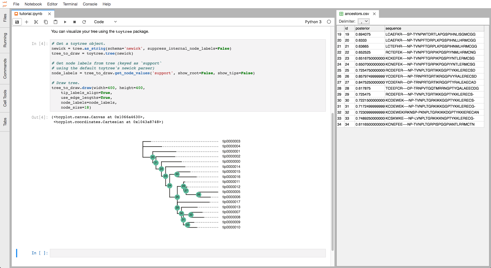

# PyASR

**Ancestral Sequence Reconstruction in Python**

PyASR provides a simple Python interface for Ancestral Sequence Reconstruction (ASR). Easily reconstruct a set of ancestral protein sequences from a phylogenetic tree and a multiple sequence alignment without leaving Python. Check out the example below!

Under the hood, PyASR wraps [PAML](http://abacus.gene.ucl.ac.uk/software/paml.html) ("Phylogenetic Analysis by Maximum Likelihood"). It then uses [PhyloPandas](https://github.com/Zsailer/phylopandas) to store the results in human-readable DataFrames. 

**NOTE:** PyASR currently only supports protein reconstructions. This is a work in progress.

## Basic Usage

```python
import phylopandas as pd
import dendropy as d
import pyasr

# Use phylopandas to read a set of ancestor.s
df_seqs = pd.read_fasta('test.fasta')

# Use dendropy to read in tree.
tree = d.Tree.get(path='tree.newick', schema='newick')

# Reconstruct nodes in tree.
tree, df_seqs, df_anc = pyasr.reconstruct(df_seqs, tree, working_dir='test', alpha=1.235)

# Write out ancestor dataframe to a CSV file.
df_anc.to_csv('ancestors.csv')
```

We can visualize the ancestors side-by-side with the tree using inside of JupyterLab
thanks to the ToyTree library.



## Install

This package is released on PyPi. You can install using pip:
```
pip install pyasr
```

To get the development version:
```
git clone 
cd 
pip install -e .
```

## Dependencies

The actual reconstruction calculation are done using [PAML](http://abacus.gene.ucl.ac.uk/software/paml.html). This requires PAML to be 
installed and the `codeml`/`baseml` executables exported to your `$PATH` environment variable. Directions for installing PAML can be found on the PAML website. 

The following Python dependencies are required for PyASR to work.

- Pandas
- Biopython
- PhyloPandas
- DendroPy
